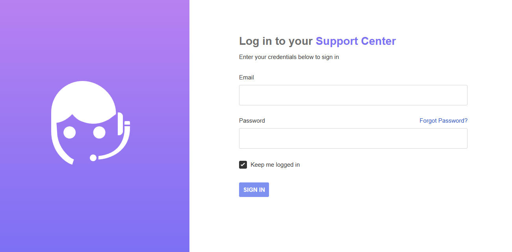

# UVdesk CI/CD pipeline

Deploy UVdesk with CI/CD on Elestio

 
 

# Once deployed ...

You can open UVdesk UI here:

    URL: https://[CI_CD_DOMAIN]/en/member/login
    email: [ADMIN_EMAIL]
    password: [ADMIN_PASSWORD]

You can open PHPMyAdmin here:

    URL: https://[CI_CD_DOMAIN]:53189
    login: root
    password: [ADMIN_PASSWORD]
